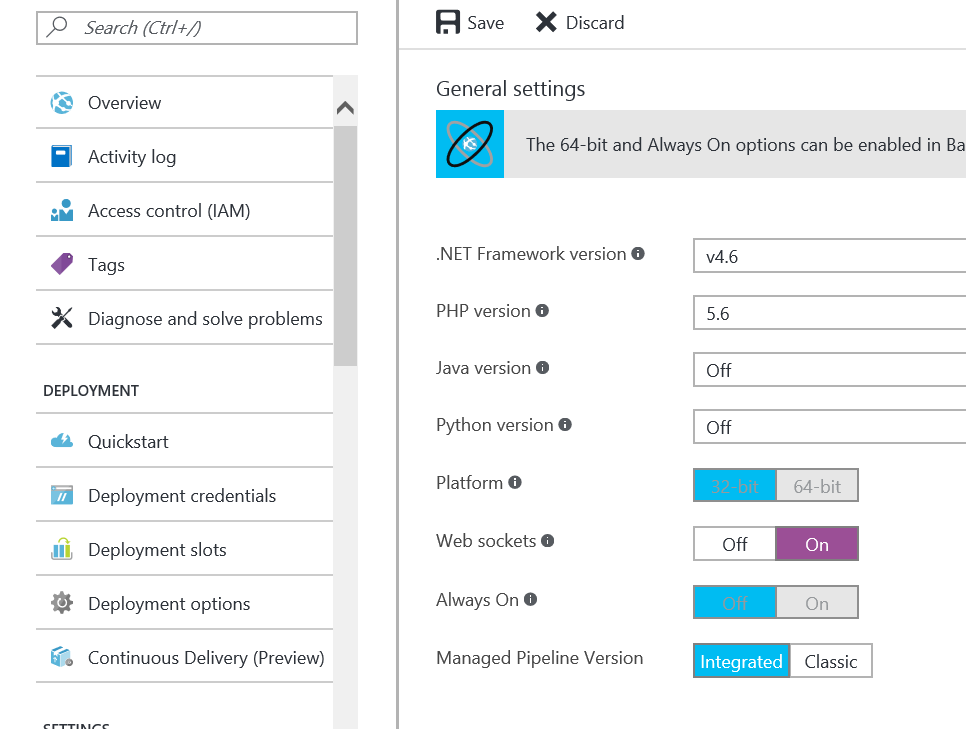
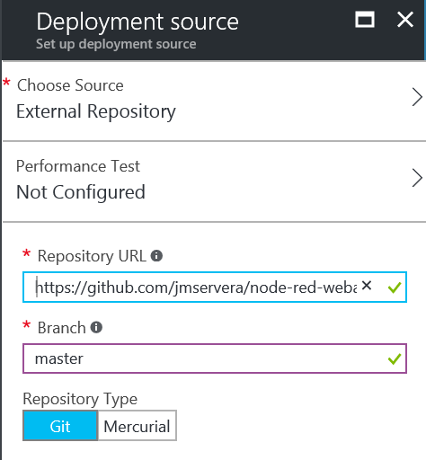

# node-red-azure-webapp
A webapp wrapper for running node-red in an Azure Web App.
To use it just:

1. Deploy to Azure with this button:

Or...

1. Create an Azure Web App
1. Open the settings and activate **Web sockets**

    

    **Figure 1** Activate Web sockets
1. Configure the deployment options as an *External repository* pointing to [https://github.com/jmservera/node-red-webapp.git](https://github.com/jmservera/node-red-webapp.git)

    

    **Figure 2** External Repository

Open your site and wait until everything is deployed. It comes with some cool nodes preinstalled:

* Dashboard (create an awesome ui and see it in https://yoursite/ui )
* Azure IoT Hub
* Cognitive Services
* Azure Storage (Blobs & Tables)
* DocumentDB
* Azure SQL

To secure this deployment and add an admin password edit the `settings.js` file.

> This project currently uses a workaround to avoid a small problem caused with `child_process.execFile`: it uses a fake npm.cmd that points to the real one.

